# STEDI Human Balance – Data Lakehouse Platform

## 📌 Project Overview
This project implements a **modern Data Lakehouse architecture** on AWS for the **STEDI Human Balance** dataset.  
The goal is to ingest raw sensor and customer data, enforce data privacy and quality, and produce an **analytics‑ and machine‑learning–ready dataset** using serverless cloud services and industry best practices.

The solution combines the **flexibility of a data lake** with the **governance and analytics capabilities of a data warehouse**, following a **Medallion (Bronze–Silver–Gold) architecture**.

---

## 🏗️ Architecture Summary

**Core Technologies**
- **Amazon S3** – Scalable object storage (data lake)
- **AWS Glue** – Serverless ETL engine
- **AWS Glue Data Catalog** – Centralized metadata & schema management
- **Amazon Athena** – Serverless SQL analytics
- **Apache Spark (Glue)** – Distributed data processing
- **Apache Parquet** – Columnar storage format for analytics

**Key Design Principles**
- Serverless & cost‑efficient
- Open file formats (no vendor lock‑in)
- Privacy‑aware data transformations
- Decoupled storage and compute
- SQL‑first analytics

---

## 🧠 Data Lakehouse Design

This project follows a **Medallion Architecture**, a standard lakehouse pattern used in production environments.

### 🥉 Bronze Layer – Landing (Raw Data)
Raw JSON data ingested without modification.

**Tables**
- `customer_landing` (956 rows)
- `accelerometer_landing` (81,273 rows)
- `step_trainer_landing` (28,680 rows)

**Location**
- `s3://stedi-human-balance-ye/landing/customer_landing/`
- `s3://stedi-human-balance-ye/landing/accelerometer_landing/`
- `s3://stedi-human-balance-ye/landing/step_trainer_landing/`

**Format:** JSON  
**Schema Definition:** Athena `CREATE EXTERNAL TABLE` DDL (see [`sql/`](sql/))

---

### 🥈 Silver Layer – Trusted (Cleaned & Privacy‑Filtered)
Data filtered for customers who consented to share with research, and joined to remove non‑matching records.

**Tables**
- `customer_trusted` (482 rows) – Customers with `shareWithResearchAsOfDate IS NOT NULL`
- `accelerometer_trusted` (40,981 rows) – Accelerometer readings matched to trusted customers
- `step_trainer_trusted` (14,460 rows) – Step Trainer readings matched to curated customers

**Location**
- `s3://stedi-human-balance-ye/trusted/customer_trusted/`
- `s3://stedi-human-balance-ye/trusted/accelerometer_trusted/`
- `s3://stedi-human-balance-ye/trusted/step_trainer_trusted/`

**Format:** Parquet (columnar, compressed)

---

### 🥇 Gold Layer – Curated (Analytics & ML‑Ready)
Final, enriched datasets ready for downstream consumption.

**Tables**
- `customer_curated` (482 rows) – Trusted customers who also have accelerometer data
- `machine_learning_curated` (43,681 rows) – Step Trainer + accelerometer readings joined on timestamp

**Location**
- `s3://stedi-human-balance-ye/curated/customer_curated/`
- `s3://stedi-human-balance-ye/curated/machine_learning_curated/`

**Format:** Parquet

---

## 🔄 ETL Pipeline – AWS Glue Jobs

Each Glue job is implemented in PySpark, uses Spark SQL for transformations, and writes results to both S3 (Parquet) and the Glue Data Catalog.

| # | Glue Job | Source(s) | Target | Logic |
|---|----------|-----------|--------|-------|
| 1 | [`customer_landing_to_trusted.py`](Glue_Jobs_Python/customer_landing_to_trusted.py) | `customer_landing` (S3 JSON) | `customer_trusted` | Filter: `shareWithResearchAsOfDate IS NOT NULL` |
| 2 | [`accelerometer_landing_to_trusted.py`](Glue_Jobs_Python/accelerometer_landing_to_trusted.py) | `accelerometer_landing` (S3 JSON) + `customer_trusted` (Catalog) | `accelerometer_trusted` | Inner join on `user = email` |
| 3 | [`customer_trusted_to_curated.py`](Glue_Jobs_Python/customer_trusted_to_curated.py) | `customer_trusted` + `accelerometer_trusted` (Catalog) | `customer_curated` | Inner join on `email = user`, select distinct customers |
| 4 | [`step_trainer_trusted.py`](Glue_Jobs_Python/step_trainer_trusted.py) | `step_trainer_landing` (S3 JSON) + `customer_curated` (Catalog) | `step_trainer_trusted` | Inner join on `serialNumber` |
| 5 | [`machine_learning_curated.py`](Glue_Jobs_Python/machine_learning_curated.py) | `step_trainer_trusted` + `accelerometer_trusted` (Catalog) | `machine_learning_curated` | Inner join on `sensorReadingTime = timestamp` |

### Pipeline DAG

```
customer_landing ──► customer_trusted ──► customer_curated
                          │                     │
accelerometer_landing ──► accelerometer_trusted  │
                          │               │     │
                          │               ▼     ▼
                          │         step_trainer_landing ──► step_trainer_trusted
                          │                                        │
                          ▼                                        ▼
                    machine_learning_curated ◄──────────────────────┘
```

---

## 📊 Row Count Summary

| Layer | Table | Row Count |
|-------|-------|-----------|
| Landing | `customer_landing` | 956 |
| Landing | `accelerometer_landing` | 81,273 |
| Landing | `step_trainer_landing` | 28,680 |
| Trusted | `customer_trusted` | 482 |
| Trusted | `accelerometer_trusted` | 40,981 |
| Trusted | `step_trainer_trusted` | 14,460 |
| Curated | `customer_curated` | 482 |
| Curated | `machine_learning_curated` | 43,681 |

---

## 🖼️ Screenshots

### Athena Row Counts
| Table | Screenshot |
|-------|------------|
| `customer_landing` | 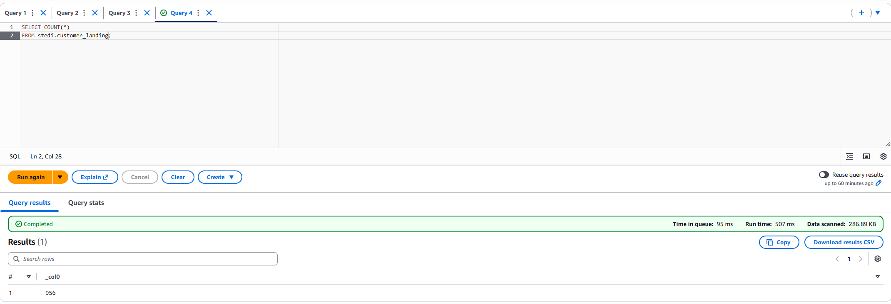 |
| `accelerometer_landing` | 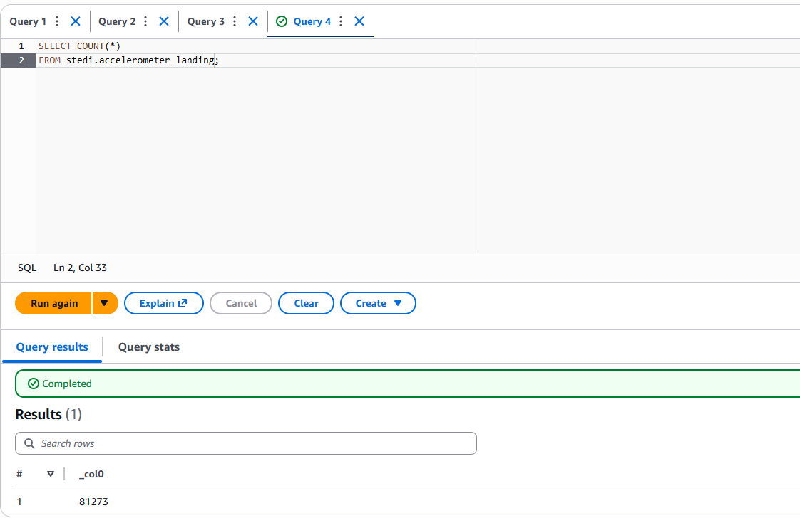 |
| `step_trainer_landing` | 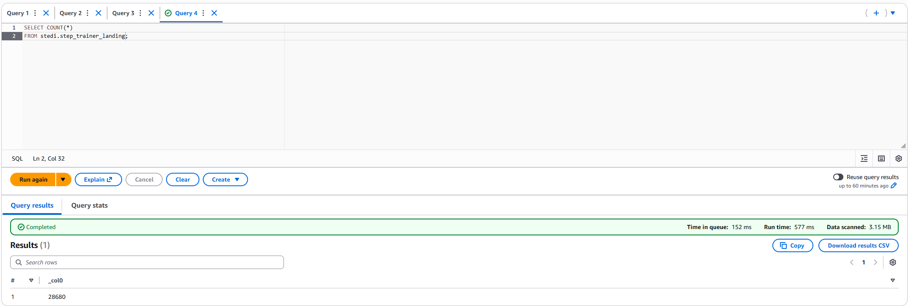 |
| `customer_trusted` | 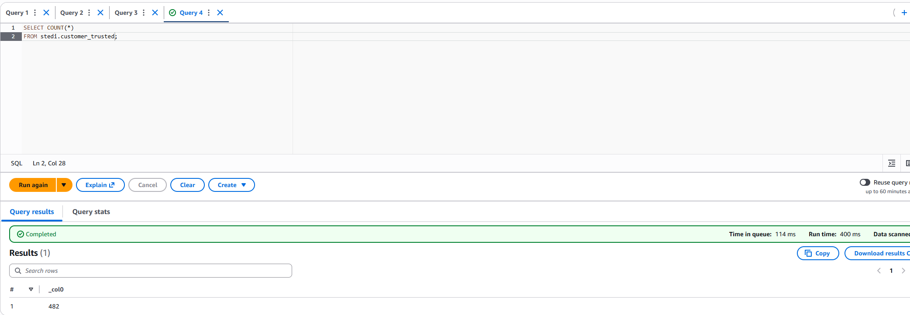 |
| `accelerometer_trusted` | 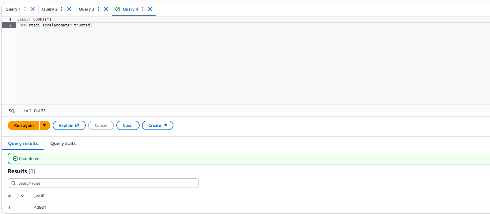 |
| `step_trainer_trusted` | 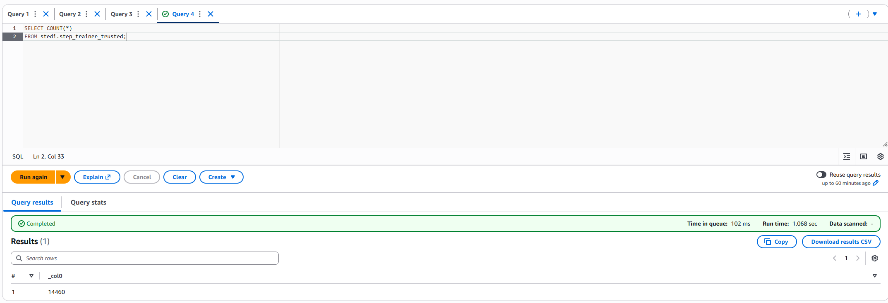 |
| `customer_curated` | 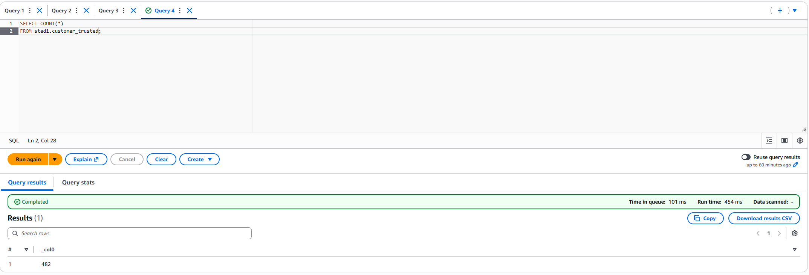 |
| `machine_learning_curated` | 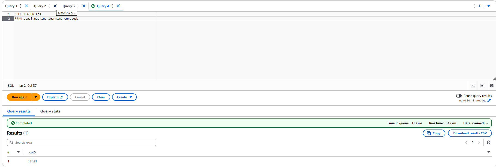 |

### Glue Job ETL Screenshots
| Job | Screenshot |
|-----|------------|
| Customer Trusted ETL | 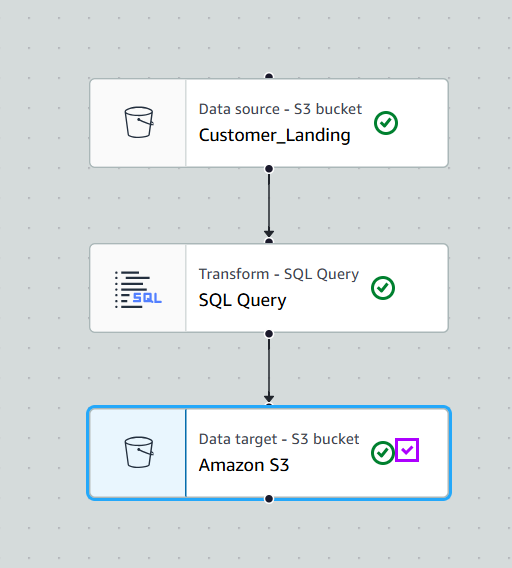 |
| Accelerometer Trusted ETL | 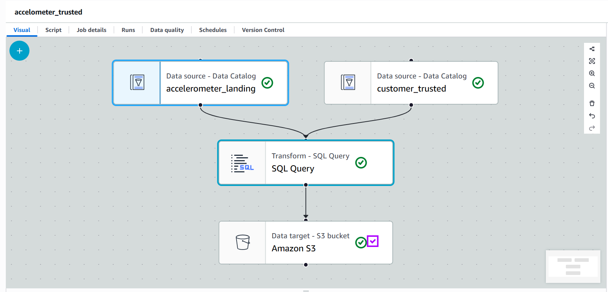 |
| Machine Learning Curated ETL | 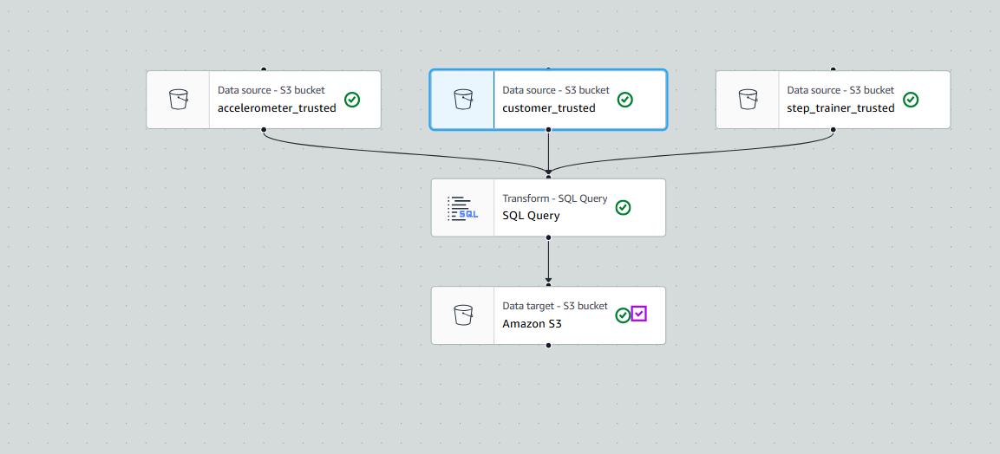 |

---

## 🗄️ SQL DDL Scripts

Landing zone tables are defined via Athena `CREATE EXTERNAL TABLE` statements:

- [`customer_landing.sql`](sql/customer_landing.sql)
- [`accelerometer_landing.sql`](sql/accelerometer_landing.sql)
- [`step_trainer_landing.sql`](sql/step_trainer_landing.sql)

ETL logic reference queries:

- [`customer_trusted_etl_job.sql`](sql/customer_trusted_etl_job.sql)
- [`accelometer_trusted_etl_job.sql`](sql/accelometer_trusted_etl_job.sql)
- [`machine_learning_curated_etl_job.sql`](sql/machine_learning_curated_etl_job.sql)

---

## 📁 Project Structure

```
├── Glue_Jobs_Python/
│   ├── customer_landing_to_trusted.py
│   ├── accelerometer_landing_to_trusted.py
│   ├── customer_trusted_to_curated.py
│   ├── step_trainer_trusted.py
│   └── machine_learning_curated.py
├── sql/
│   ├── customer_landing.sql
│   ├── accelerometer_landing.sql
│   ├── step_trainer_landing.sql
│   ├── customer_trusted_etl_job.sql
│   ├── accelometer_trusted_etl_job.sql
│   └── machine_learning_curated_etl_job.sql
├── landing_data/
│   ├── customer_landing/
│   ├── accelerometer_landing/
│   └── step_trainer_landing/
├── Screenshots_of_Count/
├── Screenshots_of_ETL/
└── README.md
```

---

## 🚀 How to Reproduce

1. **Create an S3 bucket** and upload the raw JSON files under `landing/`.
2. **Run the Athena DDL scripts** in `sql/` to create the landing zone tables in the Glue Data Catalog.
3. **Execute the Glue Jobs** in order:
   1. `customer_landing_to_trusted.py`
   2. `accelerometer_landing_to_trusted.py`
   3. `customer_trusted_to_curated.py`
   4. `step_trainer_trusted.py`
   5. `machine_learning_curated.py`
4. **Query results** in Athena to validate row counts against the summary table above.